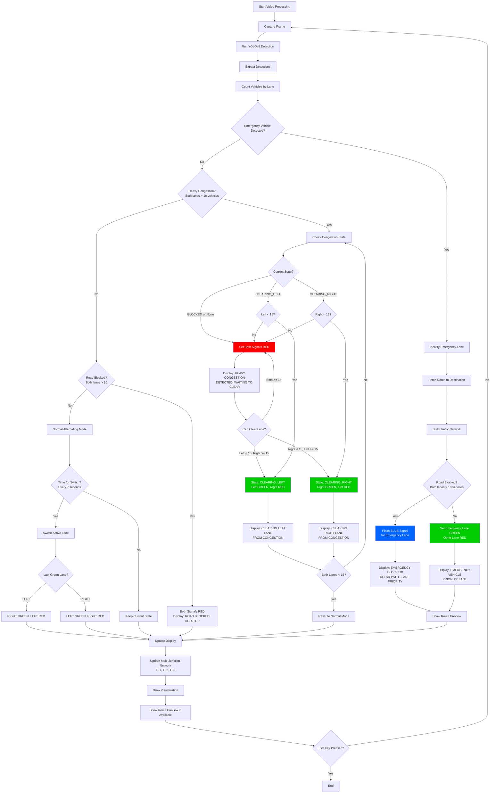
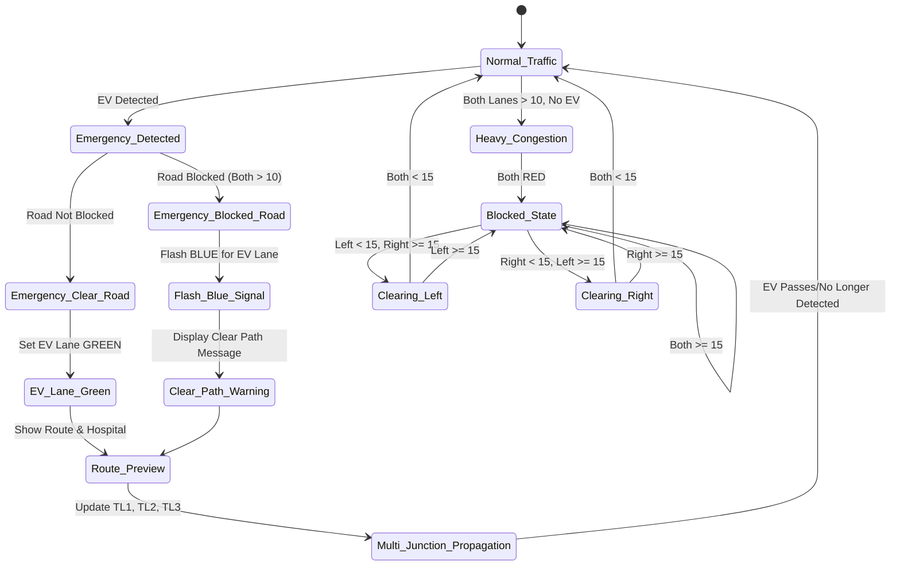
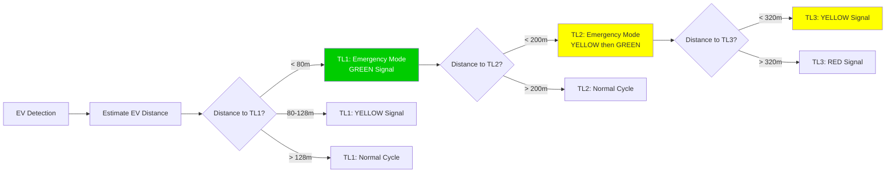

# Two-Lane AI Traffic Control System - Flowchart

## System Overview
Your AI-based emergency vehicle detection and smart traffic control system operates on a two-lane road with LEFT and RIGHT lanes, managing both normal traffic flow and emergency vehicle prioritization.

## Main Traffic Control Flow

## Emergency Vehicle Priority States

## Multi-Junction Network Propagation

## Signal Color Coding

- **RED**: Stop signal, no movement allowed
- **GREEN**: Go signal, movement allowed
- **YELLOW**: Warning/transition signal
- **BLUE**: Emergency priority signal (flashing for blocked emergency)

## Key Thresholds

- **Blocked Threshold**: 10 vehicles per lane
- **Clear Threshold**: 15 vehicles per lane
- **Emergency Trigger Distance**: 80m
- **Normal Signal Interval**: 7 seconds
- **TL1 Emergency Range**: < 80m
- **TL2 Emergency Range**: < 200m (80m + 120m)
- **TL3 Emergency Range**: < 320m (80m + 240m)

## Congestion States

1. **BLOCKED**: Both lanes > 10 vehicles, both signals RED
2. **CLEARING_LEFT**: Left lane < 15, getting GREEN priority
3. **CLEARING_RIGHT**: Right lane < 15, getting GREEN priority
4. **Normal**: Alternating signals every 7 seconds

This flowchart represents your comprehensive two-lane traffic management system with emergency prioritization and multi-junction coordination!
